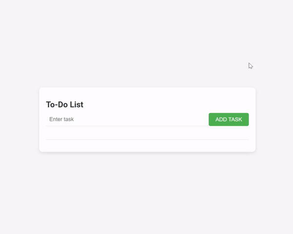

# ToDo List

This is a simple ToDo list web application built using HTML, CSS, and JavaScript. It allows users to add, delete, and mark tasks as completed. Tasks are stored locally using the browser's localStorage, making them persist even after the page is refreshed.

**Features:**
- Add new tasks: Enter a task in the input field and press the "Add Task" button to add it to the list.
- Delete tasks: Click the "X" button next to a task to delete it from the list.
- Mark tasks as completed: Check the checkbox next to a task to mark it as completed. Completed tasks will have a line-through decoration.
- LocalStorage support: Tasks are stored locally in the browser's localStorage, ensuring they are persisted across page refreshes.
- Responsive design: The application is responsive and works well on various screen sizes.

**Usage:**
1. Clone the repository to your local machine.
2. Open the `index.html` file in your web browser.
3. Start adding tasks and managing your ToDo list!

Feel free to contribute to this project by submitting pull requests or reporting issues.

**Screenshot:**

